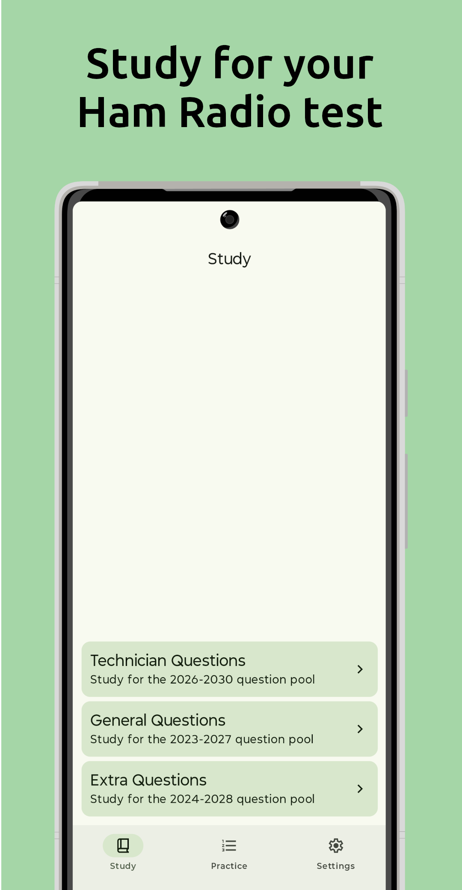
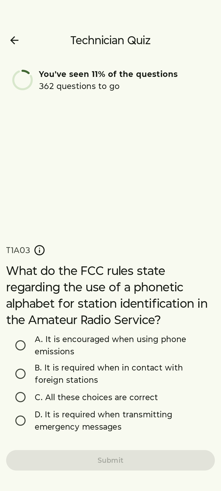
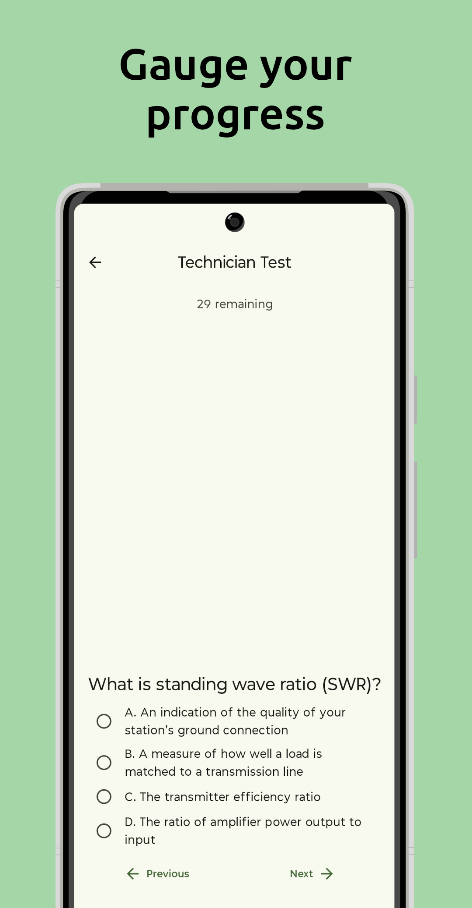
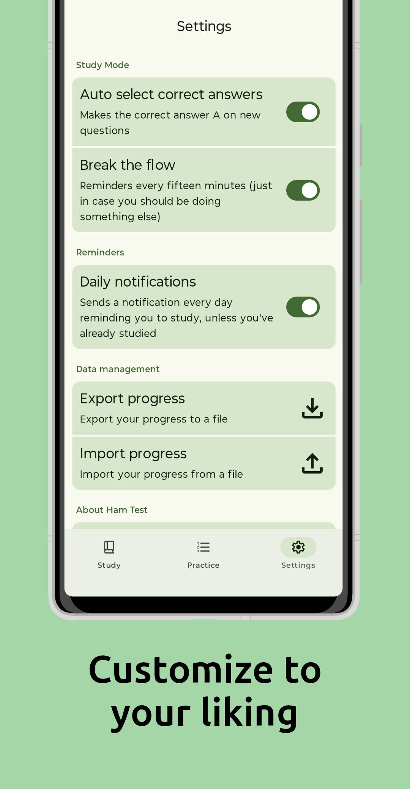

# Ham Test

An Android App for preparing for all three US Amateur Radio license exams.

There is also a web version at https://hamtest.web.app ([Also on GitHub](https://github.com/DubsterDev/HamTest))

## Features
 - Study mode featuring repetitive questions to make you remember the correct answers
 - Practice mode, which gives you a practice test that will accurately assess how well you're doing as the questions are identical as how they would appear on the test
 - Optional daily reminders to practice
 - Optional reminder every fifteen minutes to take a break

## Screenshots

